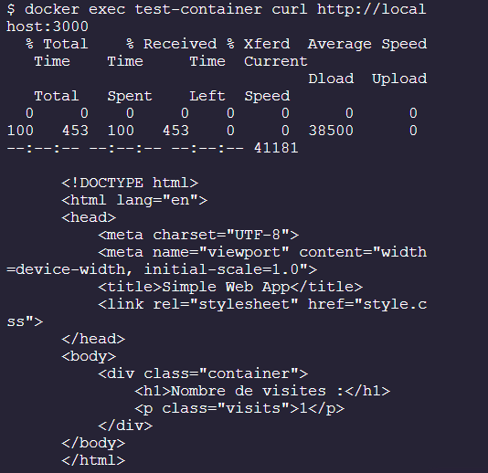
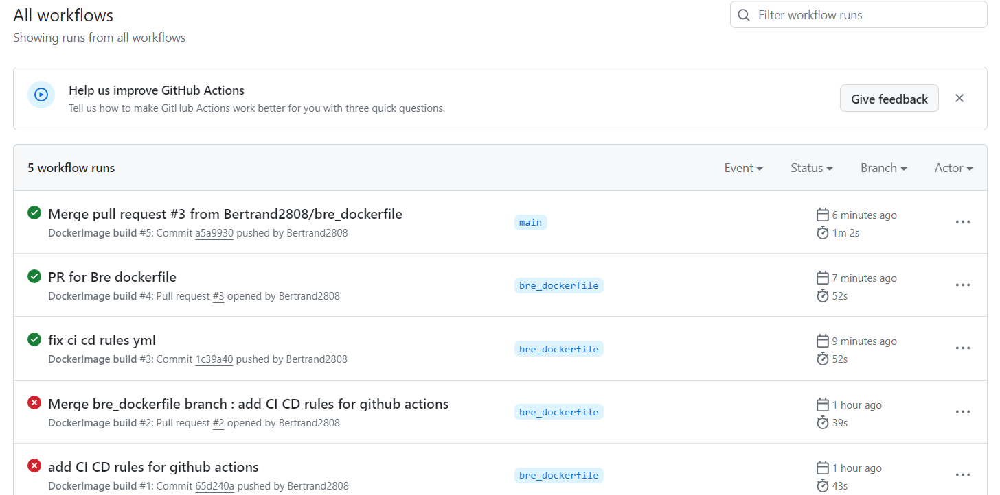

# DEVOPS ESGI

Bienvenue dans l'évaluation Devops de l'ESGI.

## Prérequis

- [Docker](https://www.docker.com/)

## Description

Ce dépôt contient une application Node.js simple qui affiche une simple page web indiquant le nombre de visite de la page. L'application est fournie avec un Dockerfile qui permet de construire une image Docker contenant l'application.

## Installation

Pour cloner le dépôt, exécutez la commande suivante :

```bash
git clone https://github.com/Bertrand2808/Devops_ESGI.git
```

## Utilisation

### Commandes pour fabriquer l'image :

Vous pouvez utiliser la commande suivante pour fabriquer l'image Docker à partir du Dockerfile :

```bash
docker image build --tag=docker-ci:1.0.0 ./
```

### Commandes pour exécuter l'image :

Vous pouvez utiliser la commande suivante pour exécuter un conteneur à partir de l'image nouvellement créée :

```bash
docker containter run -it --name docker-ci -p 3000:3000 docker-ci:1.0.0 node index.js
# docker-ci est le nom donné au conteneur à titre d'exemple
# -p permet de mapper le port 3000 du conteneur sur le port 3000 de la machine hôte
# Exemple si vous voulez changer le port de la machine hôte, vous pouvez utiliser :
docker containter run -it --name test-container -p 8080:8080 -e PORT=8080 docker-ci:1.0.0 node index.js
# dans ce cas, le port 8080 du conteneur sera mappé sur le port 8080 de la machine hôte
```

#### Exécution en Read Only dans un volume :

```bash
docker containter run -it --name docker-ci -p 3000:3000 --read-only --volume="${PWD}:/app" docker-ci:1.0.0 node index.js
# --volume permet de monter un volume
# $(pwd) permet de récupérer le chemin absolu du répertoire courant
# --read-only permet de monter le volume en lecture seule
```

### Test pour vérifier le bon fonctionnement :

#### Localement :

Vous pouvez exécuter la commande suivante pour démarrer un conteneur à partir de l'image nouvellement créée et vérifier si l'application fonctionne correctement :

```bash
# test-container est le nom donné au conteneur à titre d'exemple
docker containter run -d --name test-container docker-ci:1.0.0 node index.js
# OU
docker containter run -it --name test-container docker-ci:1.0.0 node index.js
```

Vous pouvez ensuite vérifier si l'application répond correctement en exécutant la commande suivante :

```bash
docker exec test-container curl http://localhost:3000
```

Vous devriez voir le message suivant s'afficher :



Enfin, vous pouvez arrêter le conteneur avec la commande suivante :

```bash
docker stop test-container
```

### Dans le CI Github Actions :

Les étapes du CI sont déjà définies dans le workflow GitHub Actions. Après chaque push sur la branche principale ou l'ouverture d'une pull request, le workflow construit l'image Docker et exécute des tests pour vérifier son bon fonctionnement.

Rendez vous sur le dépôt git, dans l'onglet **Actions** : https://github.com/Bertrand2808/ESGIDevops/actions

De là, vous trouverez les différents workflows qui ont été exécutés ou sont en cours d'exécution :


Pour plus de détails vous pourrez développer les onglets et afficher les logs des différentes étapes. Si l'icone indique un succès, cela signifie que le workflow a été exécuté avec succès, sinon, il y a eu un problème.



### Steps du CI / CD :

- Build Docker Image
- Launch npm run lint in a container / in a volume
- Run Docker container and curl command
- Remove Docker Container
- Login to Docker Hub
- Push Docker Image on hub if push on main branch
- Push Docker Image on hub if push on tag
- Create a release on GitHub if push on tag

## Badge


## Auteurs

- Bertrand
